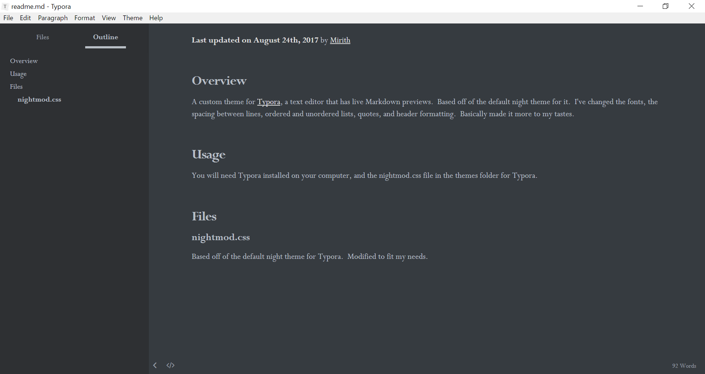
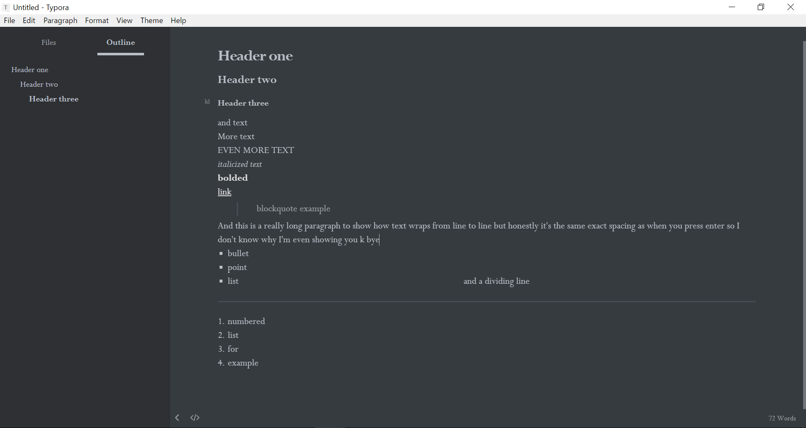

**Last updated on August 24th, 2017** by [Mirith](https://github.com/Mirith)

# Overview

A custom theme for [Typora](https://typora.io/), a text editor that has live Markdown previews.  Based off of the default night theme for it.  I've changed the fonts, the spacing between lines, ordered and unordered lists, quotes, and header formatting.  Basically made it more to my tastes.  

# Usage

You will need Typora installed on your computer, and the nightmod.css file in the themes folder for Typora.  

# Files

## nightmod.css

Based off of the default night theme for Typora.  Modified to fit my needs.  Haven't touched most of the stuff past the first third of the file.  

# Sample images

